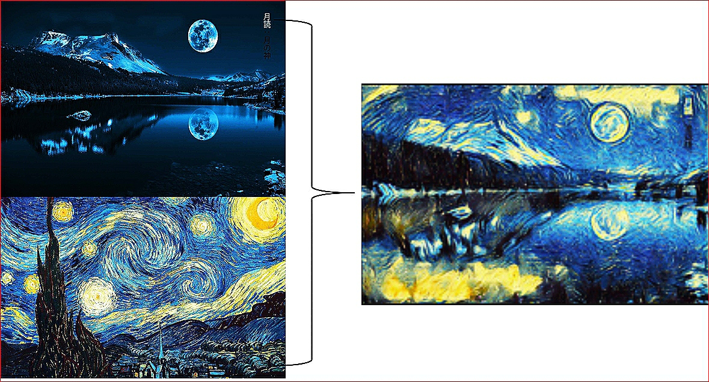

# neuro_style_transfer
this is am implementation of a well known technique in computer vision.
I have used Vgg16 pretrained model for getting the style information, feel free to play with different parameters for better understanding.

I recommend to watch this youtube video, as it was really a great help.

https://www.youtube.com/watch?v=K_xBhp1YsrE&t=249s

you can also connect with me on linkdin: 😄

https://www.linkedin.com/in/rohan-saxena-2846a5163/

# Output:

